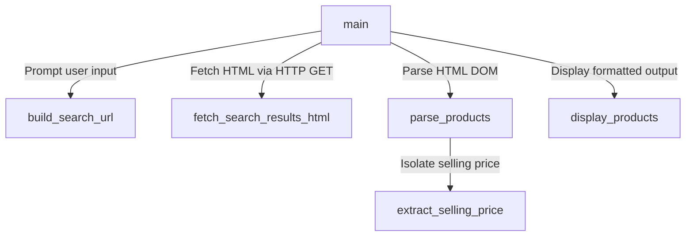

# Documentation for `scraper.py` (Product Information Extractor)

## Overview
`scraper.py` is a Python program designed to scrape product search results from the [MDComputers](https://mdcomputers.in/) website. Given a user-supplied search term, the script constructs the search URL, fetches the search results page over HTTP, parses the returned HTML, extracts product names and selling prices, and displays the formatted output in the console.

---

## Technical Specifications

### Target Website Details
- **Website:** MDComputers (`https://mdcomputers.in/`)
- **Search Endpoint:** `https://mdcomputers.in/?route=product/search&search=<search_term>`
- **HTTP Method:** `GET`

### Required Libraries
- `requests` (v2.32.3): For executing HTTP GET requests.
- `beautifulsoup4` (v4.12.3): For parsing HTML and navigating DOM elements.
- `urllib.parse`: Standard library module for safe URL query parameter encoding.
- `sys`: Standard library module for system-level controls (e.g. stdout re-configuration, process exit).

---

## Architecture & Code Structure

The script is modularly structured into dedicated functions:



### 1. `build_search_url(search_term: str) -> str`
- **Purpose:** Dynamically constructs a safe URL for searching MDComputers.
- **Implementation:** Uses `urllib.parse.urlencode` to encode the query string (mapping `route` to `product/search` and `search` to `search_term`) and joins it with `https://mdcomputers.in/`.
- **Key Advantage:** Ensures special characters or spaces in search terms are properly URL-encoded (e.g., `"external hard drive"` becomes `external+hard+drive` or `external%20harddrive`).

### 2. `fetch_search_results_html(url: str) -> str`
- **Purpose:** Downloads raw HTML content from MDComputers.
- **HTTP 403 (WAF) Prevention:** MDComputers uses Cloudflare / WAF rules that reject standard Python requests or incomplete User-Agent strings with `HTTP 403 Forbidden`. To prevent this, custom headers simulating a standard Chrome web browser are included:
  ```python
  REQUEST_HEADERS = {
      "User-Agent": "Mozilla/5.0 (Windows NT 10.0; Win64; x64) AppleWebKit/537.36 (KHTML, like Gecko) Chrome/122.0.0.0 Safari/537.36",
      "Accept": "text/html,application/xhtml+xml,application/xml;q=0.9,image/avif,image/webp,*/*;q=0.8",
      "Accept-Language": "en-US,en;q=0.9",
  }
  ```
- **Error Handling:** Invokes `response.raise_for_status()` to raise an exception if HTTP status codes indicate an error (e.g. 403, 404, 500).

### 3. `extract_selling_price(price_container) -> str`
- **Purpose:** Extracts the payable selling price from a product's price container tag.
- **Parsing Logic:**
  - MDComputers displays discounted items with an original price (strikethrough) alongside the discounted selling price.
  - Checks for modern discount tags (`<span class="ins">`) or legacy discount tags (`<span class="price-new">`). If found, returns the inner text.
  - If no discount tag exists, creates a clean DOM copy of the price container, removes strikethrough price nodes (`.del` or `.price-old`), and returns the remaining price string.

### 4. `parse_products(html_content: str) -> list[dict[str, str]]`
- **Purpose:** Parses the HTML document using BeautifulSoup and extracts a list of product records.
- **DOM Selectors:**
  - Product Card Container: Matches `product-grid-item` (with fallback to `product-thumb` and `product-layout`).
  - Title Element: Matches `product-entities-title` (or fallback `<h3>`/`<h4>` heading tags).
  - Price Block: Matches `class="price"`.
- **Returns:** A list of dictionaries in the format `[{"name": "...", "price": "..."}, ...]`.

### 5. `display_products(products: list[dict[str, str]], search_term: str) -> None`
- **Purpose:** Prints extracted product information in a clean, tabulated format in the console.
- **UTF-8 Compatibility:** Automatically detects if `sys.stdout` on Windows requires UTF-8 reconfiguration to correctly render the Indian Rupee symbol (`₹`) without throwing `UnicodeEncodeError`.

### 6. `main() -> None`
- **Purpose:** Controls overall execution flow: prompts for user input, triggers network fetch and parsing, handles exceptions gracefully, and displays results.

---

## Setup & Installation

1. Navigate to the `question1` directory:
   ```bash
   cd question1
   ```
2. Install the required dependencies:
   ```bash
   pip install -r requirements.txt
   ```

---

## Execution & Example Output

Run the scraper script:
```bash
python scraper.PY
```

### Sample Terminal Interaction:
```text
Enter search term: external hard drive

Fetching search results from: https://mdcomputers.in/?route=product%2Fsearch&search=external+hard+drive ...

Found 19 product(s) for 'external hard drive':

#    Product Name                                                           Selling Price
-----------------------------------------------------------------------------------------
1    Seagate Expansion 1TB External Hard Drive                              ₹9,140
2    WD Elements 1TB External Hard Drive                                    ₹9,290
3    WD My Passport 1TB External Hard Drive                                 ₹9,740
4    Seagate One Touch 1TB External Hard Drive                              ₹9,770
5    WD Elements 2TB Portable Hard Drive                                    ₹10,990
6    WD My Passport 2TB External Hard Drive                                 ₹11,250
7    Seagate Expansion 2TB External Hard Drive                              ₹11,480
8    Seagate One Touch 2TB External Hard Drive                              ₹11,980
9    Seagate One Touch 2TB Silver External Hard Drive                       ₹11,980
10   WD My Book 4TB External Hard Drive                                     ₹16,780
```

---

## Error Handling Scenarios
- **Empty Input:** Validates input and exits gracefully if no search term is entered.
- **Network Failures / Timeouts:** Catches `requests.RequestException` and displays error feedback without crashing.
- **HTTP 403 Forbidden:** Solved via custom browser headers.
- **No Products Found:** Displays a clear message: `No products found for '<search_term>'.`
